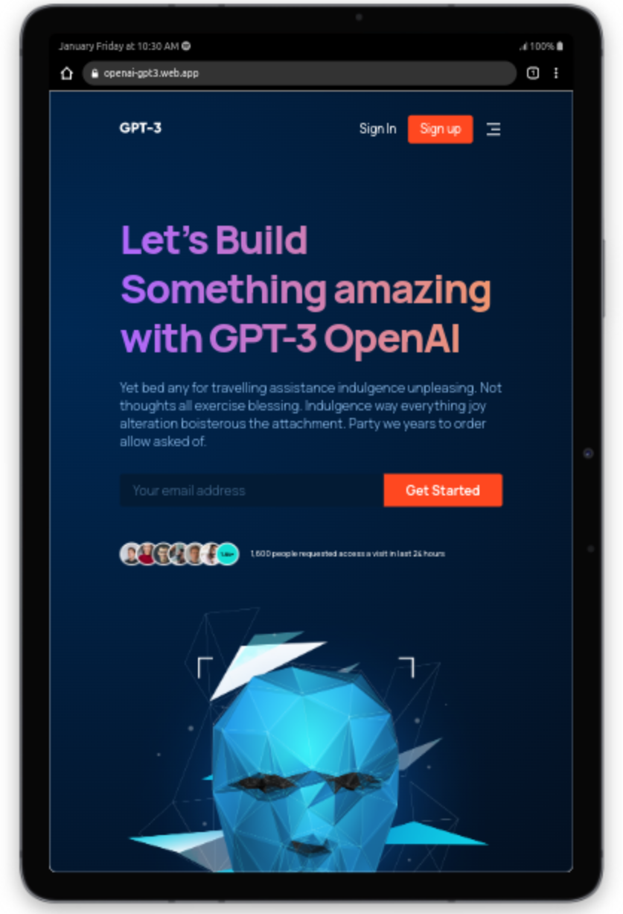

# GPT-3 (Generative Pre-trained Transformer 3)

This project is a frontend single page website of GPT-3, the predecessor of ChatGPT. An AI model by OpenAI that generates human-like text, completes language tasks, and generates code.

The figma design is by JS-Mastery. I made a few changes on the design to make the website fully responsive and visually appealing on all devices.

### Technologies:

- React
- React-Icons
- CSS
- Firebase Hosting

#### Deployment

The live website is deployed and hosted on firebase. You can find the link to the live website below.

[Live Website](https://openai-gpt3.web.app)

#### Key Lessons Learnt:

- Responsive web design
- React Props
- React useState
- Reuseable Components
- Standard React folder structure
